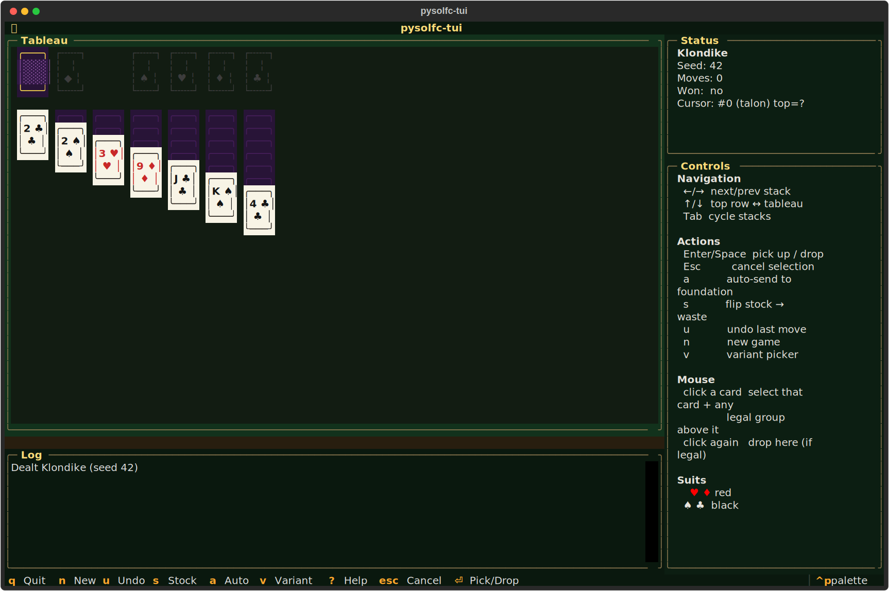
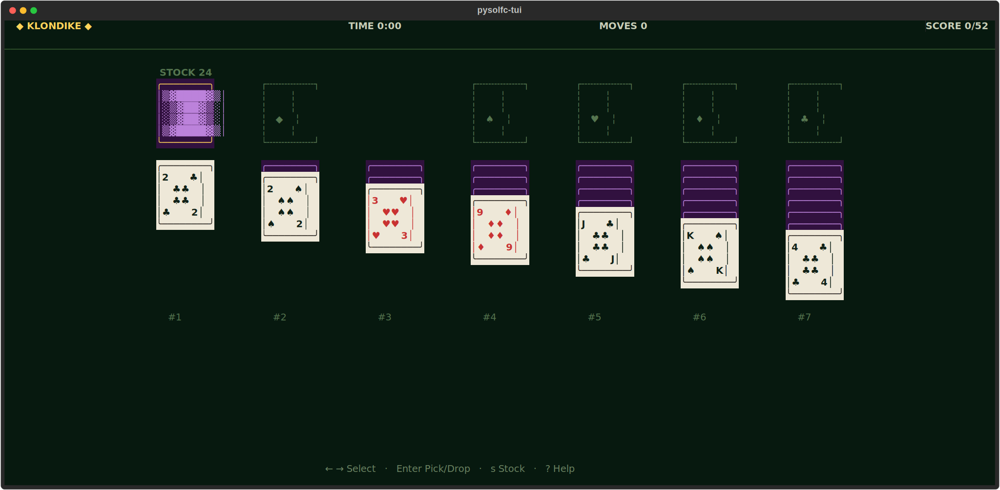

# pysolfc-tui
One deck. Eleven games. Infinite patience.




## About
Eleven solitaires in one tape. Klondike (turn-1 and turn-3), FreeCell, Spider, Yukon, Golf, Simple Simon, Spiderette and more. Unicode cards, mouse + keyboard, unlimited undo, clean win detection. The patience-game vault, distilled to a single terminal binary.

## Screenshots


## Install & Run
```bash
git clone https://github.com/akakabrian/pysolfc-tui
cd pysolfc-tui
make
make run
```

## Controls
| Key | Action |
|-----|--------|
| `←` `→` | cursor prev/next stack |
| `↑` `↓` | top row ↔ tableau |
| `Enter` / `Space` | pick up / drop held cards |
| `Esc` | cancel selection |
| `a` | auto-send to foundations |
| `s` | flip stock → waste (or recycle) |
| `u` | undo |
| `n` | new game (same variant) |
| `v` | variant picker modal |
| `?` | help screen |
| `q` | quit |
| mouse click | select that card (+ any legal stack above) / drop |

## Testing
```bash
make test       # QA harness
make playtest   # scripted critical-path run
make perf       # performance baseline
```

## License
GPL-3.0

## Built with
- [Textual](https://textual.textualize.io/) — the TUI framework
- [tui-game-build](https://github.com/akakabrian/tui-foundry) — shared build process
